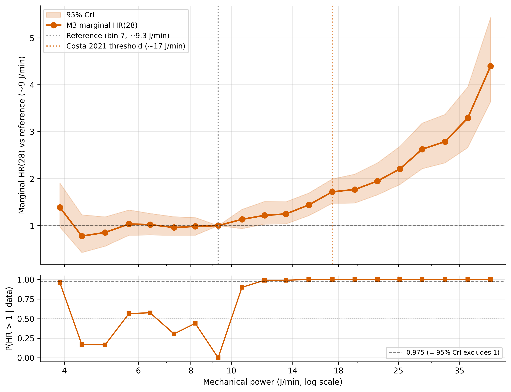
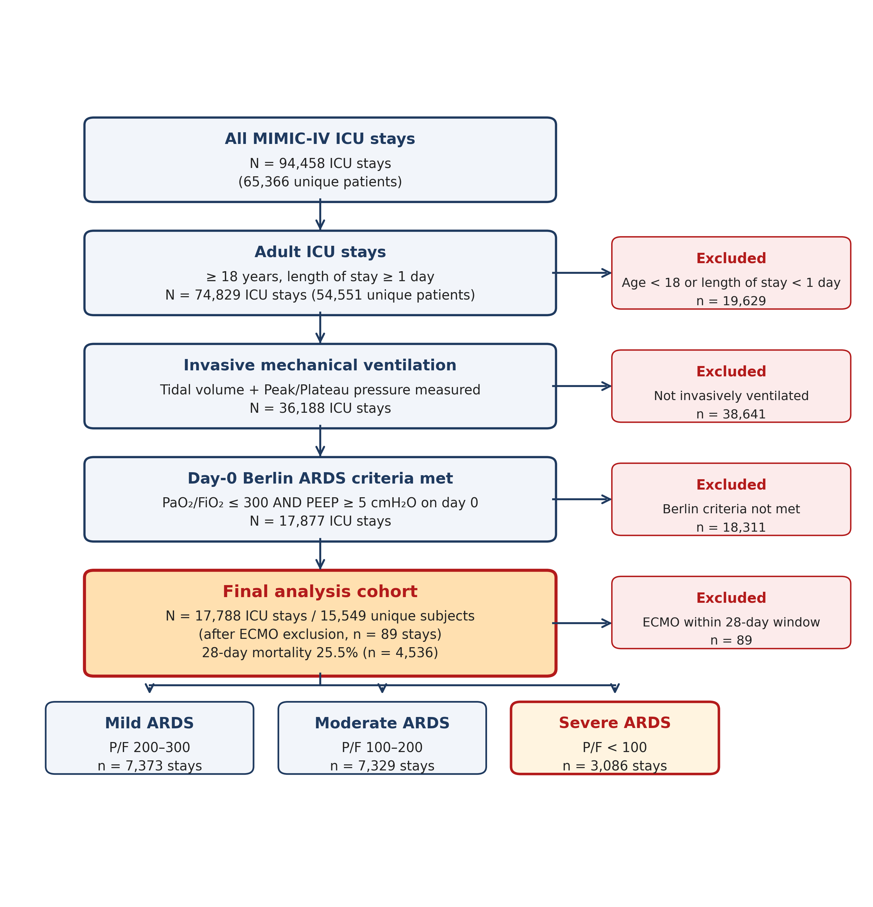

# Bayesian Functional Random-Effect NICE g-formula

[](https://www.python.org/downloads/)
[](https://jax.readthedocs.io)
[](https://num.pyro.ai)
[](https://opensource.org/licenses/MIT)

Code accompanying the master's thesis *"Causal effect of mechanical power on
28-day mortality in acute respiratory distress syndrome: a Bayesian
functional random-effect g-formula"* (Yonsei University Graduate School of
Public Health, 2026).

The thesis estimates the dose–response of mechanical power (MP, J/min) on
28-day in-hospital mortality in ARDS using a Bayesian parametric g-formula
with a subject-specific time-varying functional random effect on the
outcome hazard, applied to MIMIC-IV v3.1 (N = 17,788 ICU stays / 15,549
unique subjects, after ECMO exclusion of 89 stays).

---

## Methodological summary

The contribution of this work is the embedding of a **functional random
effect (FRE)** — a subject-specific time-varying spline-basis deviation on
the outcome hazard — into the **NICE** (Non-Iterative Conditional
Expectation) parametric g-formula of Robins (1986) / Bang & Robins (2005).

The functional random effect itself is a known parameterization: it
coincides with the *random factor smooth* of generalized additive mixed
modeling (Wood 2017) and the *functional mixed-effects* parameterization
of Guo (2002). The novelty is operational — coupling this spline-basis RE
to the outcome layer of the NICE g-formula and integrating the resulting
subject-level functional deviation by Bayesian forward simulation, with
explicit comparison against a scalar Y-RE specification (Keil 2017
Bayesian g-formula) and a joint scalar Y+L RE specification (Xu 2024
multivariate GLMM).

### Estimand and identification

Under sequential exchangeability, positivity, consistency, and no
interference, the counterfactual cumulative incidence under the sustained
MP regime $\bar a = (a_1, \dots, a_T)$ is identified by

$$
F_{\bar a}(T) =
\mathbb{E}_{\bar L}\!\left[1 - \prod_{s=1}^{T} \bigl(1 - h(\bar a_s, \bar L_s, V;\, \theta)\bigr)\right].
$$

This is estimated by NICE forward simulation: sample $L_t$ trajectories
sequentially from the parametric covariate model under the counterfactual
treatment regime, average outcome predictions across the simulated
cohort.

### 4-specification ladder

| Spec | RE structure | $L$ propagation |
|---|---|---|
| M1 | No random effect (baseline) | Stochastic NICE sampling |
| M2 | Scalar Y-RE (random intercept on hazard) | Stochastic NICE sampling |
| **M3** (primary) | **Functional Y-RE (rank-5 natural cubic spline, knots {0, 3, 7, 14, 21})** | Stochastic NICE sampling |
| M4 | Joint scalar Y-RE + scalar L-RE (Xu 2024–inspired) | Deterministic mean propagation |

The outcome model for M3 is

$$
\mathrm{logit}\,P(Y_{it}=1) = \beta_0 + \beta_A^{\top} \mathbf{1}[A_{it}]
+ \beta_L^{\top} L_{it} + \beta_V^{\top} V_i + \beta_t \cdot t + b_i^{\top} B(t),
$$

where $B(t)$ is a QR-orthonormalized natural cubic spline basis with knots
at days $\{0, 3, 7, 14, 21\}$. The subject-level coefficient vector is
$b_i \sim \mathcal{N}_5(0, \Sigma_b)$ with
$\Sigma_b = \mathrm{diag}(\tau)\,\Omega\,\mathrm{diag}(\tau)$,
$\tau \sim \mathrm{HalfCauchy}(0, 2.5)$, and $\Omega \sim \mathrm{LKJ}(\eta = 2)$.

### Inference

- Bayesian posterior sampling via NumPyro NUTS (Hoffman & Gelman 2014).
- M3 (primary): 4 chains × (2,000 warmup + 1,000 samples), target
  acceptance 0.99.
- M1/M2: 4 chains × (1,000 warmup + 1,000 samples), target 0.95.
- M4: 2 chains × (1,500 warmup + 750 samples), target 0.95.
- Forward simulation vectorized with JAX vmap + scan.
- Cluster-level (per-subject) log-likelihood recorded for WAIC model
  comparison (Vehtari et al. 2017, §4).

---

## Headline result

Marginal dose–response of mechanical power on 28-day mortality, M3 (rank-5
functional Y-RE). Reference: bin 7 ≈ 9.3 J/min.



| MP exposure (J/min) | Marginal HR (95% CrI) | $P(\mathrm{HR}>1)$ |
|---|---|---|
| ~12 (bin 9) | 1.22 (1.03–1.52) | 0.990 |
| **17.4 (bin 12, primary contrast)** | **1.72 (1.48–1.99)** | **1.000** |
| ~28 (bin 16) | 2.63 (2.21–3.18) | 1.000 |
| ~42 (bin 19, exposure ceiling) | 4.40 (3.64–5.43) | 1.000 |

Cohort flow diagram (MIMIC-IV → analysis cohort) :



### Model comparison (cluster-level WAIC + paired SE_diff)

Per-unique-subject (N = 15,549 RE group clusters) WAIC, with paired SE_diff
per Vehtari et al. 2017 §4.2. Sign convention: $\Delta\mathrm{WAIC}
= \mathrm{WAIC}_{\mathrm{comp}} - \mathrm{WAIC}_{\mathrm{M3}}$ (positive ⇒ M3
preferred). Thesis §Ⅲ.6 (Table 7).

| Spec | WAIC | SE_obs | ΔWAIC vs M3 | SE_diff | ratio | ρ(elpd) |
|---|---|---|---|---|---|---|
| **M3 (functional Y-RE, primary)** | **16,200** | 288 | 0 (ref) | — | — | — |
| M2 (scalar Y-RE) | 16,837 | 294 | +636 | 32.0 | 19.9× | 0.9941 |
| M1 (no-RE) | 17,119 | 297 | +919 | 42.5 | 21.6× | 0.9899 |
| M4 (joint scalar Y+L RE) | 17,268 | 297 | +1,067 | 46.8 | 22.8× | 0.9877 |

All differences exceed 10× SE_diff. Caveat: ~12.3% of clusters have
$p_{\mathrm{waic},i} > 0.4$ (Vehtari §4.2 threshold), so PSIS-LOO or K-fold
cross-validation is recommended as a future-work robustness check.
Absolute WAIC magnitudes are used as a *ranking auxiliary*, not as
definitive causal-contrast preference evidence (thesis §Ⅲ.6, §Ⅳ.4).

---

## Repository layout

```
fre-nice-gformula/
├── data/                            # Cohort CSV (NOT committed — PhysioNet credentialed)
├── results/
│   ├── figures/                     # 8 manuscript figures (PNG): fig1 cohort flow,
│   │                                # fig2 4-spec forest, fig3 dose-response (M3),
│   │                                # fig4 RMST 2-panel, fig5 per-day HR, fig6 LOCO bar,
│   │                                # fig7 Case-1/2 PPC, fig8 severity stratum dose-response
│   └── tables/                      # 9 reproducible tables (Markdown): T1 baseline,
│                                    # T2 4-spec ladder, T3 full dose-response, T4 RMST,
│                                    # T5 per-day HR, T6 LOCO, T7 WAIC, T8 PPC,
│                                    # TS1 severity stratum
├── scripts/
│   ├── run_bayesian_main.py         # NUTS fit runner; single-spec (M1/M2/M3/M4) execution
│   ├── run_chain.sh                 # Full pipeline: M3 + sensitivity + LOCO + subgroups
│   ├── run_j0_loco.sh               # M1 (no-RE) LOCO batch: 23 confounders × refit
│   ├── run_g_formula.py             # Forward simulation: marginal HR / RMST / per-day HR / PPC
│   ├── make_outputs.py              # Auxiliary post-processing (figure styling, etc.)
│   └── make_thesis_outputs.py       # Regenerate all thesis tables + figures from state files
├── src/
│   ├── data/
│   │   ├── ards.py                  # MIMIC-IV ARDS cohort assembly, 20-bin MP discretization
│   │   └── bq_extract/cohort.sql    # BigQuery extraction (MIMIC-IV v3.1)
│   ├── models/
│   │   └── spline_glmm.py           # Natural cubic spline basis (rank K, QR-orthonormalized)
│   └── benchmarks/
│       ├── standard_gformula.py     # Frequentist NICE g-formula reference
│       ├── fre_nice_bayesian.py     # Bayesian M1 / M2 / M3 FRE-NICE
│       ├── xu_glmm_bayesian.py      # Bayesian M4 (Xu 2024–inspired joint Y+L RE)
│       └── g_formula.py             # Forward simulation utilities
├── requirements.txt
└── README.md
```

---

## Reproduction

### Environment

```bash
pip install -r requirements.txt
```

Tested on Python 3.10.12, JAX 0.4.30 (CUDA 12.2), NumPyro 0.13.2,
single NVIDIA V100 GPU.

### Data

The ARDS cohort CSV (`data/ards_cohort.csv`) is not redistributed:
MIMIC-IV v3.1 access requires PhysioNet credentialed access. Cohort
assembly logic is in `src/data/ards.py`; the BigQuery extraction SQL is
`src/data/bq_extract/cohort.sql`.

### Pipeline

```bash
# Single M3 fit (primary specification, functional Y-RE, rank 5 NCS)
# V100 GPU recommended; ~8 min wall-time.
python scripts/run_bayesian_main.py \
    --csv data/ards_cohort.csv --out-dir _draft/results/extracted/main \
    --inference nuts --n-warmup 2000 --n-samples 1000 --n-chains 4 \
    --target-accept 0.99 --n-posterior-subset 200 \
    --methods J5 --phase fit

# Full pipeline: M1/M2/M3/M4 fits + spline rank sensitivity + LOCO + subgroups
bash scripts/run_chain.sh

# M1 (no-RE) LOCO batch — 23 confounders × refit
bash scripts/run_j0_loco.sh

# G-formula forward simulation (marginal HR / RMST / per-day HR / PPC)
python scripts/run_g_formula.py

# Regenerate all thesis tables + figures from state files
python scripts/make_thesis_outputs.py
```

`make_thesis_outputs.py` is fully deterministic — the same state files
produce identical figures and tables.

### Reproducibility notes

- Random seeds are fixed for all stochastic procedures (NUTS sampling,
  forward simulation, posterior sub-sampling).
- MCMC convergence verified by R̂ < 1.01 and bulk ESS > 1,000 for β
  parameters in the primary M3 fit.
- 22 of 23 LOCO refits met the predefined criterion
  (β at primary contrast: R̂ < 1.05, ESS > 400) on the first attempt;
  the `anchor_age` LOCO did not (R̂ = 1.546, ESS = 738) and is flagged
  in the thesis §Ⅲ.5 / §Ⅳ.6 with an asterisk.

---

## Citation

If you use this codebase, please cite the master's thesis and the
methodological anchors below:

- Robins, J. M. (1986). A new approach to causal inference in mortality
  studies with a sustained exposure period. *Mathematical Modelling*, 7,
  1393–1512.
- Hernán, M. A., & Robins, J. M. (2020). *Causal Inference: What If*.
  CRC Press.
- Keil, A. P., Daza, E. J., Engel, S. M., Buckley, J. P., & Edwards, J. K.
  (2018). A Bayesian approach to the g-formula. *Statistical Methods in
  Medical Research*, 27(10), 3183–3204.
- Xu, Y., Kim, J. S., Hummers, L. K., Shah, A. A., & Zeger, S. L. (2024).
  Causal inference using multivariate generalized linear mixed-effects
  models. *Biometrics*, 80(3), ujae100.
- Guo, W. (2002). Functional mixed effects models. *Biometrics*, 58(1),
  121–128.
- Vehtari, A., Gelman, A., & Gabry, J. (2017). Practical Bayesian model
  evaluation using leave-one-out cross-validation and WAIC. *Statistics
  and Computing*, 27(5), 1413–1432. arXiv:1507.04544.
- Costa, E. L. V., Slutsky, A. S., Brochard, L. J., et al. (2021).
  Ventilatory variables and mechanical power in patients with acute
  respiratory distress syndrome. *American Journal of Respiratory and
  Critical Care Medicine*, 204(3), 303–311.

---

## License

MIT.
